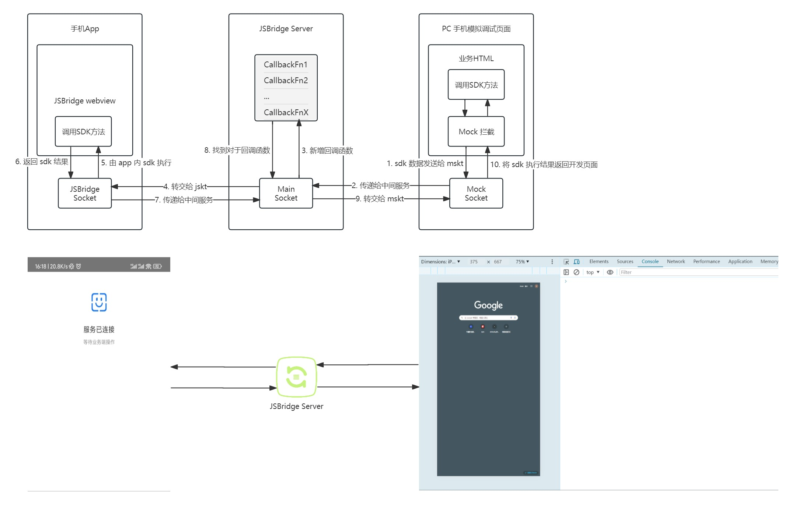

# webpack-jsbridge-plugin

A webpack plugin to proxy jsBridge request on JSBridge Server, then you can develop on pc browser without real phones.



## Usage

```js
// vue.config.js
const JSBridgePlugin = require("webpack-jsbridge-plugin");

module.exports = defineConfig({
  configureWebpack: {
    plugins: [
      new JSBridgePlugin({
        port: 3300,
        origin: ["http://192.168.13.115:8080"],
      }),
    ],
  },
});
```

## Attention 🔊

In this plugin, the following JavaScript APIs are exposed for both Android and iOS:

call app sdk:

```txt
window.androidJS.nativeMethod // android

window.webkit.messageHandlers.nativeObject.postMessage // ios
```

sdk callback:

```txt
window.receiveMessage
```

If you define other methods, you will need to customize some methods to override them:

```js
// override mock, 通过 inject 注入
window.youSDKMethod = (arg1, arg2) => {
  const data = { arg1, arg2 };
  return window.$jsBridge.invoke(data);
};

window.youSDKCallback = (arg1, arg2)=>{
  onst data = { arg1, arg2 };
  window.receiveMessage(data)
}
```

```js
// override jsbridge, 通过 server public 覆盖
window.$jsBridge.invoke = (data) => {
  const { arg1, arg2 } = data;
  return window.youSDKMethod(arg1, arg2);
};

window.receiveMessage = (data) => {
  const { arg1, arg2 } = data;
  window.youSDKCallback(arg1, arg2);
};
```
